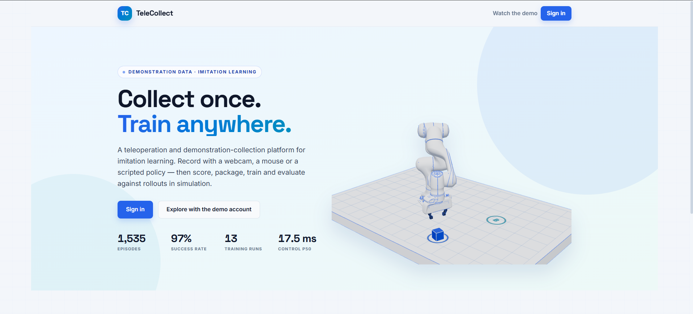

# 👋 Hi, I'm Dang Minh Quang

### 🤖 AI • Robotics • Reinforcement Learning • Computer Vision • LLMs

---

# 🚀 About Me

- 🎓 Student at **HUS - VNU**
- 🤖 Passionate about **Robotics & Autonomous Navigation**
- 🧠 Interested in **Reinforcement Learning**
- 👁️ Building **Computer Vision** applications
- 💬 Exploring **Large Language Models**

---

# 🚀 Featured Projects

## 🤖 TeleCollect Platform

**End-to-end robotics data platform for imitation learning**

Collect demonstrations through hand-tracking teleoperation or scripted policies, review and package datasets, train BC/BC-RNN policies, and evaluate checkpoints with simulation rollouts.

 

[**Live Demo**](https://telecollect.io.vn) · [**Video Demo**](https://www.youtube.com/watch?v=eWnuH2-vsIE) · [**Repository**](https://github.com/quangdz312/TeleCollect-Platform)

 

---
# 📊 GitHub Analytics

<table>
<tr>

<td width="50%" align="center">

</td>

<td width="50%" align="center">

</td>

</tr>
</table>

# 🛠️ Tech Stack

## 🤖 Robotics

---

## 🧠 AI & Machine Learning

---

## 💻 Programming Languages

---

## ⚙️ Tools

---

# 🎯 Current Focus

- 🤖 ROS2 Robot
- 🧠 Reinforcement Learning
- 👁️ Computer Vision
- 💬 Large Language Models

---

# 📚 Currently Learning

- ✅ Python
- ✅ C++
- ✅ PyTorch
- ✅ Reinforcement Learning
- 🔄 ROS2

---

# 👀 Profile Views

  

---

### 💡 Quote

> *"Learning by building. Building by experimenting."*

